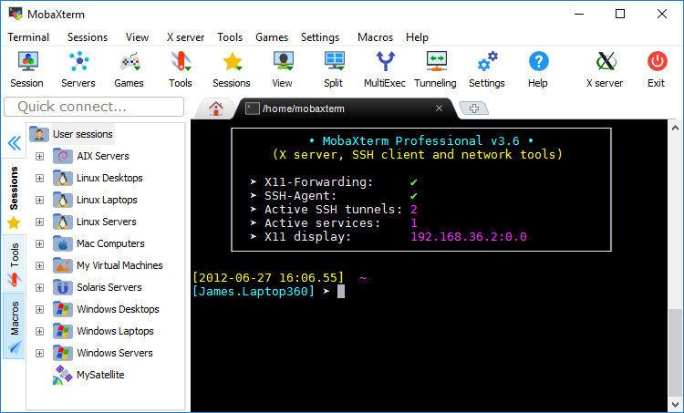
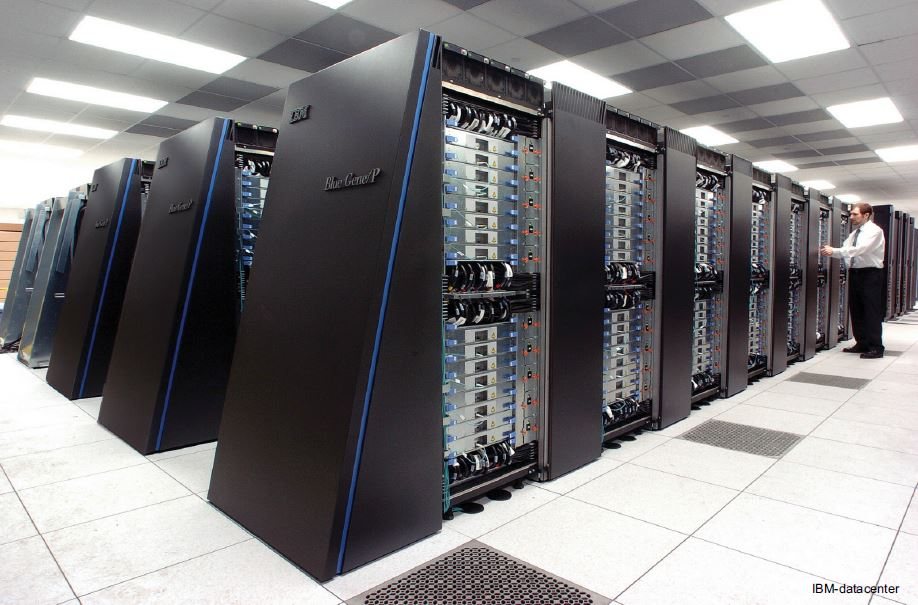
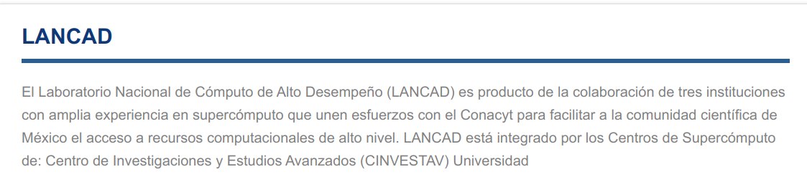
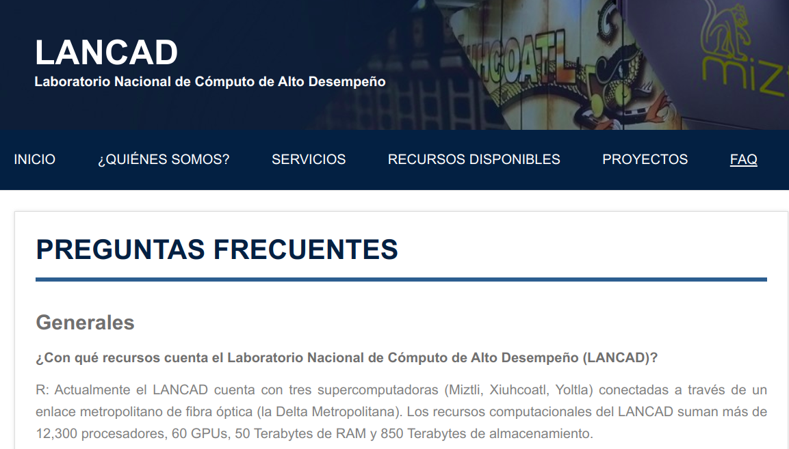

##### ** Instalar MobaXterm**  <a name="subparagraph3"></a>  

##  Cluster de supercómputo <a name="paragraph3"></a> 

Un cluster de supercómputo es una computadora de alto rendimiento que utiliza cientos/miles de nodos que trabajan en paralelo para resolver problemas complejos en conjunto.   
Los nodos de supercómputo están optimizados con aceleradores que  intercambian e integran datos a velocidades que las máquinas comunes no pueden alcanzar.  

 

 
 
  
 

## Acceso a super cómputo por protocolo SSH <a name="paragraph3"></a>

- SSH (Secure Shell) es un programa para entrar en una máquina remota y ejecutar comandos en esa máquina.
- El protocolo SSH proporciona comunicaciones seguras y encriptadas entre dos hosts a través de una red insegura.    

***Estructura base:***   

~~~   
usuario@sistema:~$ ssh -p puerto usuario@direccionIP    
~~~    

***Supercómputo del Laboratorio de Ecología UNAM***   

~~~   
usuario@sistema:~$ ssh -p 4020 user4@132.248.49.137   
~~~    

#### **Proyectos colaboratvos con Git y GitHub** 

{width='100px'}

Los proyectos involucrados con Ciencia de Datos incluyen una colección de datos, código fuente/scrips, figuras, informes , etc, los cuáles sufren modificaciones durante el curso del proyecto.  

> 
**Git**  
- Sistema de control de versiones, útil para grupos que trabajan proyectos colaborativos involucrados cómo desarrollo de software.   
- Registra la evolución de un archivo a través del tiempo, e identificar los cambios hechos por cada colaborador.  
- Para más información entra a [Happy Git with R](https://happygitwithr.com/).   
> 

{width='100%'height=100%} 

> 
**Github:**  
- Host remoto en Internet, que  actúa como un canal de distribución para los proyectos administrados por Git.   
- Permite compartir, almacenar y sincronizar proyectos entre los colaboradores de **manera remota**, para realizar lectura y edición de los archivos, a través de los llamados **repositorios**  

{width='50%'height=50%} 
>   

***Ventajas:***  
* Flujos de trabajo ordenados  
* Estructurar y administrar el historial de versiones  
* Compartir proyectos para que prueben tu código   
* Permitir que tus colegas revisen tus proyectos y realicen modificaciones en nuevas bifurcaciones   
* Enviar sugerencias, cambios en el código al propietario  
* Tener un backup de tus proyectos  

* Clonar repositorio y sincronizar proyectos a través de línea de comandos

```{bash}
# git clone /path/to/repository
# git add <filename>
# git commit -m "Commit message"
# git pull
# git push 

```

# <span style="color: #00868B;"> **Pasos iniciales con la interfaz de la línea de comandos**</span>  

#### El entorno de la terminal  <a name="subparagraph4"></a> 

* El entorno de la terminal: La pantalla de la terminal representa nuestro interprete de comando, así como lo observamos, está listo para empezar a recibir ordenes que posteriormente transformará en en resultados.  
* Se llama prompt a los caracteres que se muestran en una línea de comandos para indicar que está a la espera de recibir órdenes.    

Al lado izquierdo del cursor (_) se observará siempre  
  i. el nombre de usuario  
  ii. el nombre de la máquina o sistema  
  iii. el lugar en el que nos encontramos (~).  

~~~
usuario@sistema:~$_  
~~~ 

#### Organización de directorios <a name="subparagraph4"></a> 

El sistema de archivos de GNU/Linux tiene una estructura jerárquica de directorios y subdirectorios que dependen del directorio raíz.  
Se puede imprimir la estructura de directorios de tu home u otro directorio: 


```{bash}
#tree -L 1 -d $HOME/Escritorio/Practicas
```
{width='100%'height=100%} 


***Ubicación del directorio actual***  
Para iniciar a dar órdenes al sistema, es esencial cumplir con la sintaxis adecuada para que se entienda lo que queremos decir o hacer.  
Ej. Si nosotros queremos que el sistema nos muestre el contenido del directorio en el que nos encontramos actualmente no podemos poner
"muestrame el contenido del directorio"  

 ~~~
 usuario@sistema:~$ muestrame el contenido del directorio
#El interprete de comandos nos va a decir: 
 muestrame: no se encontró la orden  
~~~  
 
* Por ejemplo para pedirle al sistema que nos indique dónde nos encontramos ubicados usaremos el comando **pwd** y en pantalla nos desplegará la ubicación. 

~~~
usuario@sistema:~$ pwd   
/home/usuario  
~~~  

Con la opción  **man** (de manual, en inglés) o **help** podemos conocer lo que nos ofrece o puede hacer un comando.  

~~~
usuario@sistema:~$ man pwd    
usuario@sistema:~$ pwd --help    
~~~  
 


#### Aprendiendo a usar comandos <a name="subparagraph4"></a> 
Los comandos algunas veces necesitan parámetros (opciones y/o argumentos) para establecer opciones específicas.  
a. **¿Qué son las opciones:** Indican sobre qué directorio o archivo hay que ejecutar el programa indicado. Se escribe seguido del comando. Generalmente es una letra precedida por un guion.  
b. **¿Qué es un argumento?** Es una indicación sobre qué directorio o archivo hay que ejecutar el programa indicado. Generalmente se pone después del comando y las opciones.

EJEMPLO  

***Comando ls ***  
* Lista los archivos de un directorio y muestra información acerca de los FICHEROs (del directorio actual por defecto).  
* Sintaxis: ls [OPCIÓN]... [FICHERO]...  
* Podemos acceder a las opciones de un comando con el manual.   

~~~
usuario@sistema:~$ man ls
~~~ 

* Nosotros le podemos pedir al comando que nos muestre el contenido de un directorio con/sin los elementos que contiene:   

~~~   
usuario@sistema:~$ ls /home/ -l   
~~~    


***NOTAS:***
* Hay comandos que no requieren argumentos  
* Es importante tener en cuenta que se debe dejar espacio entre cada componente de la orden.
* Dado lo anterior podemos asumir que un comando puede esperar ninguno, uno o varios parámetros.  
* La estructura general queda como sigue: 

~~~
comando  opciones  argumentos
~~~

* ***Es importante resaltar que a las opciones siempre las antecede un guion:***
* El orden de los parámetros y las opciones puede ser indistinto.

~~~   
a. usuario@sistema:~$ ls /home/ -l   
b. usuario@sistema:~$ ls -l /home/  
~~~    

#### Navegar por el sistema de directorios y/o archivos. <a name="paragraph5"></a>     
En esta sesión veremos el sistema de directorios, es decir cómo podemos movernos dentro de nuestro sistema de directorios y/o archivos, como crear, modificar, entre otros.  

#### Ubicación y contenido <a name="subparagraph5"></a>    
* Tenemos que saber entonces que una instrucción siempre se ejecuta desde un lugar, un punto dentro de mi estructura o sistema de directorios.  
* Para empezar a movernos dentro de nuestra estructura de directorios tenemos que utilizar un comando que nos ayude a cambiarnos de directorio, este es el comando ***cd***.  
* El comando ***cd*** modifica el directorio actual de trabajo del shell.  


```{bash}
#Directorio actual:
pwd
#Moverme al directorio 02.Directorio:
cd  02.Directorio
#Confirmar el nuevo directorio:
pwd
```
  
* El comando ***ls*** nos permite listar el contenido de un directorio. Tiene varias opciones que podemos conocer con el manual de ls, entre ellas son: ls -l, ls -lh, ls -lr, ls -lt, ls -ltr. ¿Qué hace cada uno de ellos? :  

```{bash}
# man ls 
```
  

Nota: Para desarrollar los siguientes temas, nos vamos a la máquina virtual y abrimos el sistema de carpetas en Windows y al mismo tiempo la terminal, trabajaremos con la carpeta de Ejercicios_Bash.    
  
#### Las rutas. Tipos, usos y características <a name="subparagraph5"></a> 

* La ruta es la localización o ubicación de un archivo o directorio.  
* En ocasiones podemos tener un archivo con el mismo nombre pero puede estar localizado en diferentes directorios, por lo tanto, la ruta es particular para cada uno.  
* Siempre debemos colocar la ruta precisa del archivo para que nuestro interprete de comandos pueda llevar a cabo la acción que le estamos ordenando.  


**Sistema de ventanas gráficas vs. Terminal**  
El sistema de ventana de archivos, es el sistema común de carpetas y documentos que vemos en una computadora con sistema operativo Windows o Mac:  
{width='100%'height=100%}    
La terminal tiene una distribución diferente o una representación gráfica distinta.  
{width='100%'height=100%}  
**Rutas absolutas y relativas**  
La ruta absoluta siempre comienza en el directorio raíz (/) 

~~~
	usuario@sistema:~$ cd /home/anahi/01.Bash/Ejercicios_Bash/documentos
~~~  

Las rutas relativas indican dónde se encuentra un fichero dentro de un sistema de ficheros comenzando desde el directorio de trabajo o directorio actual  

~~~
	 usuario@sistema:~$ cd borradores/primer-trimestre
~~~  

**Sensibilidad entre mayúsculas, minúsculas y espacios **  
El lenguje de Bash es sensible entre mayúsculas, minúsculas y espacios utilizados en los nombres de los ficheros o archivos.  

* Por ejemplo para el nombre de un directorio al que le queremos iniciar con una mayúscula:  
~~~
Documentos 
~~~
* Bash reconocerá como un directorio diferente si tenemos otro directorio con el mismo nombre pero inicia con minúscula:  
~~~
documentos
~~~
* Finalmente si nosotros queremos crear un directorio con un nombre como:
~~~
mkdir borrador datos finales
~~~
* Bash creará tres directorio diferentente debido a que va interpretar el espacio como un operador para crear un elemento indipendiente. Lo recomendable en estos casos es utilizar guion medio o guión bajo si deseamos crear directorios o archivos con nombres largos
~~~
borradores_datos_finales 
ó
borradores-datos-finales
~~~


#### Crear, mover, renombrar, copiar y borrar y ver el contenido de archivos y directorios <a name="subparagraph5"></a> 

##### El comando ***mkdir***
Función: Permite crear nuevos directorios
Sintaxis: mkdir [OPCIÓN]... DIRECTORIO...

~~~
	 usuario@sistema:~$ mkdir ejercicio_1
~~~ 

##### El comando ***mv***
Función: Permite mover archivos y directorios de un directorio a otro.  
Sintáxis: mv [OPCIÓN]... ORIGEN... DIRECTORIO  

~~~
	 usuario@sistema:~$ ejercicio_1 ./borradores
~~~ 

Función: También permite renombrar un archivo o directorio.  
Sintáxis: mv Nombre_Inicial ...Nombre_Final ..  

~~~
	 usuario@sistema:~$ mv ejercicio_1  Ejercicios_1
~~~ 

##### El comando ***rm***
Función: Permite borrar archivos, enlaaces y directorios (sólo sí se incluye opción -r).  
Sintáxis: rm [OPCIÓN]... [FICHERO]...   

~~~
	 usuario@sistema:~$ rm -r ejercicios_1
~~~ 

##### El comando ***cat ***
Función: Permite ver el contenido de archivos  
Sintáxis: cat [OPCIÓN]... [FICHERO]...  

~~~
	 usuario@sistema:~$ cat borrador-datos-finales.doc
~~~ 

##### El comando ***cp***  
Función: Permite copiar un archivo a otro. También puede copiar varios ficheros en un directorio determinado.    
Sintáxis: cp [OPCIÓN]... ORIGEN... DIRECTORIO   
~~~
	 usuario@sistema:~$ cp borrador_datos-inicales.doc /home/usuario/Ejercicios_Bash
~~~ 

####   Atajos de Bash <a name="subparagraph5"></a>     
Existen tips o atajos en el lenguaje Bash que nos facilita la ejecución de comandos.  

 **Atajo** |  **Función** | 
----------------------| ----------------------| ---------------|
|↑     | Muestra los comandos ejecutados anteriormente |   
|../   | Nos posiciona en un directorio anterior  |
|↹     | Ayuda a completar/predecir el nombre de un archivo, directorio, rutas, comandos, programas, etc.
|↹ ↹   | Muestra cuáles elementos podemos elegir dentro del fichero donde estamos posicionados  |
|>    | Sobreescribe un archivo si existe, o crea un nuevo archivo, con el resultado de la salida de un comando |  
|>>  | Agrega el resultado de la salida de un comando, a un archivo ya existete| 

####  Uso del ***pipe ' | '*** <a name="subparagraph6"></a>   
Función: Un pipe es un flujo de datos que circula entre dos procesos. El resultado de un comando o programa, será la entrada para un nuevo comando/programa.  
La ventaja es dividir una tarea grande, en pequeñas tarea o pasos.  

Sintáxis:  

~~~
usuario@sistema:~$ Comando-1 | Comando-2 | …| Comando-N
~~~

#### Comodines <a name="subparagraph5"></a>  

* ***El asterisco*** < * > sirve para indicar que en el lugar donde se encuentra puede haber cualquier cadena de caracteres. Es decir, < *.txt > indica que se incluyen todos los ficheros (directorios y archivos) que tengan cualquier nombre, pero se obliga a que la extensión sea txt.  

~~~
	 usuario@sistema:~$ rm /home/alumno/*.txt
~~~ 

* ***La interrogación*** representa cualquier carácter, pero repetido unicamente una vez. El asterisco se podía sustituir por uno o varios caracteres, pero no así la interrogación.  

~~~
	 usuario@sistema:~$ rm /home/alumno/borrador-dato?-finales.doc
~~~ 

####  Editor de texto <a name="subparagraph5"></a>    
* Los editores de texto también se conocen como editores de código.  
* Son aplicaciones que permiten generar y editar una gran cantidad de archivos de lenguaje de programación.  
* GNU ***nano*** es un editor de texto de línea de comandos fácil de usar para sistemas operativos Unix y Linux.  
* Incluye toda la funcionalidad básica que esperaría de un editor de texto regular.  

* Para abrir un archivo existente o para crear un nuevo archivo:  

~~~
usuario@sistema:~$ nano FileName
* Esto abre el archivo o una nueva ventana del editor y se puede comenzar a editar el archivo.
~~~ 

{width='100%'height=100%}  

* En la parte inferior de la ventana, hay una lista de los comandos más básicos para usar con el editor. 

***Comando***         |  ***Descripción***    |
----------------------| ----------------------|
*Ctrl+G.* | Obtener una lista de todos los comandos 
*Ctrl+O*  |  Guardar cambios
*Ctrl+X*  | Salir del editor
